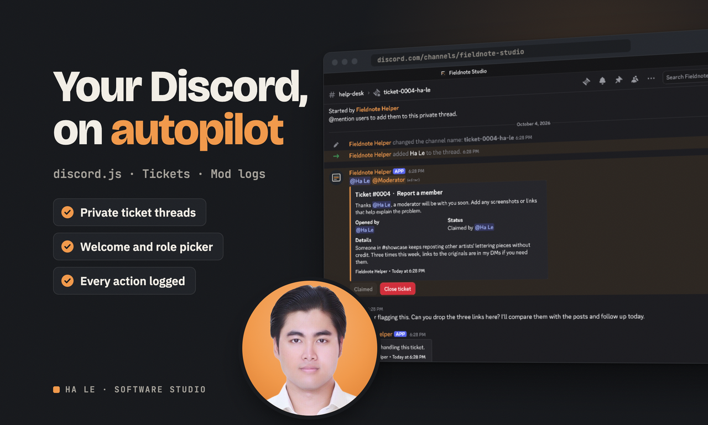

# Fieldnote Helper (sample Discord bot)

Fieldnote Helper is a Discord bot for community servers, built with discord.js v14 and slash commands. It greets new members with a welcome card and a role picker, opens private ticket threads from a topic menu, lets moderators claim and close tickets, saves a readable transcript of each ticket, and logs every moderation action in a private #mod-log channel. It also has /warn, /warnings, /timeout, /purge and /userinfo, and it blocks links from members who joined less than ten minutes ago.

To run it, create an application and bot in the Discord Developer Portal, turn on the Server Members and Message Content intents, and invite the bot with the Manage Roles, Manage Channels, Moderate Members, Manage Messages, Manage Threads and Create Private Threads permissions. Copy `.env.example` to `.env`, fill in the token, application id and server id, then run `npm install`, `node src/deploy.js` to register the commands and `node src/index.js` to start the bot. Run `/setup` once in your server to create the channels and roles, and optionally `node src/post-rules.js` to post the rules.

`npm test` runs the offline checks on the command definitions, embeds and ticket store. Settings and tickets are kept in a small JSON file under `data/`, which is easy to swap for a database.

This is a portfolio sample. The screenshots come from a private test server, "Fieldnote Studio", with made up content.

